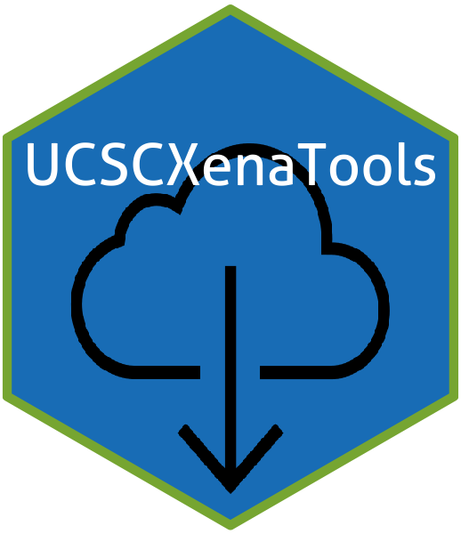

<!-- README.md is generated from README.Rmd. Please edit that file -->

```{r, echo = FALSE}
knitr::opts_chunk$set(
  collapse = TRUE,
  comment = "#>",
  fig.path = "README-"
)
```

<!-- badges: start -->

<table class="table">
<thead>
<tr class="header">
<th align="left">
Usage
</th>
<th align="left">
Release
</th>
<th align="left">
Development
</th>
</tr>
</thead>
<tbody>

<tr class="odd">
<td align="left">
<a href="https://www.gnu.org/licenses/gpl-3.0.en.html"></a>
</td>
<td align="left">
<a href="https://cran.r-project.org/package=UCSCXenaTools"></a>
</td>
<td align="left">
<a href="https://travis-ci.org/ropensci/UCSCXenaTools"></a>
</td>
</tr>

<tr class="even">
<td align="left">
<a href="https://cran.r-project.org/"></a>
</td>
<td align="left">
<a href="https://cran.r-project.org/web/checks/check_results_UCSCXenaTools.html"></a>
</td>
<td align="left">
<a href="https://ci.appveyor.com/project/ShixiangWang/UCSCXenaTools"></a>
</td>
</tr>

<tr class="odd">
<td align="left">
<a href="https://CRAN.R-project.org/package=UCSCXenaTools"></a>
</td>
<td align="left">
<a href="https://github.com/ropensci/software-review/issues/315"></a>
</td>
<td align="left">
<a href="https://codecov.io/github/ShixiangWang/UCSCXenaTools?branch=master"></a>
</td>
</tr>

<tr class="even">
<td align="left">
<a href="https://CRAN.R-project.org/package=UCSCXenaTools"></a>
</td>
<td align="left">
<a href="https://zenodo.org/badge/latestdoi/178662770"></a>
</td>
<td align="left">
<a href="https://github.com/ropensci/UCSCXenaTools/issues?q=is%3Aissue+is%3Aclosed"></a>
</td>

</tr>
<tr class="odd">
<td align="left">
<a href="https://CRAN.R-project.org/package=UCSCXenaTools"></a>
</td>
<td align="left">
<a href="https://doi.org/10.21105/joss.01627">
</a>
</td>
<td align="left">
<a href="https://www.repostatus.org/#active"></a>
</td>
</tr>
</tbody>
</table>
<br>
<!-- badges: end -->

# UCSCXenaTools 

**UCSCXenaTools** is an R package for accessing genomics data from UCSC Xena platform, from cancer multi-omics to single-cell RNA-seq. 
Public omics data from UCSC Xena are supported through [**multiple turn-key Xena Hubs**](https://xenabrowser.net/datapages/), which are a collection of UCSC-hosted public databases such as TCGA, ICGC, TARGET, GTEx, CCLE, and others. Databases are normalized so they can be combined, linked, filtered, explored and downloaded.

**Who is the target audience and what are scientific applications of this package?**

* Target Audience: cancer and clinical researchers, bioinformaticians
* Applications: genomic and clinical analyses

## Table of Contents

* [Installation](#installation)
* [Data Hub List](#data-hub-list)
* [Basic usage](#basic-usage)
* [Citation](#citation)
* [How to contribute](#how-to-contribute)
* [Acknowledgment](#acknowledgment)

## Installation

Install stable release from CRAN with:

```{r, eval=FALSE}
install.packages("UCSCXenaTools")
```

You can also install devel version of **UCSCXenaTools** from github with:

```{r gh-installation, eval = FALSE}
# install.packages("remotes")
remotes::install_github("ropensci/UCSCXenaTools")
```

If you want to build vignette in local, please add two options:

```{r, eval=FALSE}
remotes::install_github("ropensci/UCSCXenaTools", build_vignettes = TRUE, dependencies = TRUE)
```

## Data Hub List

All datasets are available at <https://xenabrowser.net/datapages/>.

Currently, **UCSCXenaTools** supports the following data hubs of UCSC Xena.

* UCSC Public Hub: <https://ucscpublic.xenahubs.net/>
* TCGA Hub: <https://tcga.xenahubs.net/>
* GDC Xena Hub: <https://gdc.xenahubs.net/>
* ICGC Xena Hub: <https://icgc.xenahubs.net/>
* Pan-Cancer Atlas Hub: <https://pancanatlas.xenahubs.net/>
* UCSC Toil RNAseq Recompute Compendium Hub: <https://toil.xenahubs.net/>
* PCAWG Xena Hub: <https://pcawg.xenahubs.net/>
* ATAC-seq Hub: <https://atacseq.xenahubs.net/>
* Singel Cell Xena Hub: <https://singlecellnew.xenahubs.net/>
* Kids First Xena Hub: <https://kidsfirst.xenahubs.net/>
* Treehouse Xena Hub: <https://xena.treehouse.gi.ucsc.edu:443/>

Users can update dataset list from the newest version of UCSC Xena by hand with `XenaDataUpdate()` function, followed
by restarting R and `library(UCSCXenaTools)`.

If any url of data hub is changed or a new data hub is online, please remind me by emailing to <w_shixiang@163.com> or [opening an issue on GitHub](https://github.com/ropensci/UCSCXenaTools/issues).


## Basic usage

Download UCSC Xena datasets and load them into R by **UCSCXenaTools** is a workflow with `generate`, `filter`, `query`, `download` and `prepare` 5 steps, which are implemented as `XenaGenerate`, `XenaFilter`, `XenaQuery`, `XenaDownload` and `XenaPrepare` functions, respectively. They are very clear and easy to use and combine with other packages like `dplyr`.

To show the basic usage of **UCSCXenaTools**, we will download clinical data of LUNG, LUAD, LUSC from TCGA (hg19 version) data hub. Users can learn more about **UCSCXenaTools** by running `browseVignettes("UCSCXenaTools")` to read vignette.

### XenaData data.frame

**UCSCXenaTools** uses a `data.frame` object (built in package) `XenaData` to generate an instance of `XenaHub` class, which records information of all datasets of UCSC Xena Data Hubs.

You can load `XenaData` after loading `UCSCXenaTools` into R.

```{r}
library(UCSCXenaTools)
data(XenaData)

head(XenaData)
```

### Workflow

Select datasets.

```{r}
# The options in XenaFilter function support Regular Expression
XenaGenerate(subset = XenaHostNames=="tcgaHub") %>% 
  XenaFilter(filterDatasets = "clinical") %>% 
  XenaFilter(filterDatasets = "LUAD|LUSC|LUNG") -> df_todo

df_todo
```

Query and download.

```{r, eval=FALSE}
XenaQuery(df_todo) %>%
  XenaDownload() -> xe_download
```

**For researchers in China, now Hiplot team has deployed several Xena mirror sites (`https://xena.hiplot.com.cn/`) at Shanghai. You can set an option `options(use_hiplot = TRUE)` before querying data step to speed up both data querying and downloading.**

```{r}
options(use_hiplot = TRUE)

XenaQuery(df_todo) %>%
  XenaDownload() -> xe_download
```

Prepare data into R for analysis.

```{r}
cli = XenaPrepare(xe_download)
class(cli)
names(cli)
```

## More to read

- [Introduction and basic usage of UCSCXenaTools](https://shixiangwang.github.io/home/en/tools/ucscxenatools-intro/)
- [UCSCXenaTools: Retrieve Gene Expression and Clinical Information from UCSC Xena for Survival Analysis](https://shixiangwang.github.io/home/en/post/ucscxenatools-201908/)
- [Obtain RNAseq Values for a Specific Gene in Xena Database](https://shixiangwang.github.io/home/en/post/2020-07-22-ucscxenatools-single-gene/)
- [UCSC Xena Access APIs in UCSCXenaTools](https://shixiangwang.github.io/home/en/tools/ucscxenatools-api/)

## Citation

Cite me by the following paper.

```
Wang et al., (2019). The UCSCXenaTools R package: a toolkit for accessing genomics data
  from UCSC Xena platform, from cancer multi-omics to single-cell RNA-seq. 
  Journal of Open Source Software, 4(40), 1627, https://doi.org/10.21105/joss.01627

# For BibTex
  
@article{Wang2019UCSCXenaTools,
	journal = {Journal of Open Source Software},
	doi = {10.21105/joss.01627},
	issn = {2475-9066},
	number = {40},
	publisher = {The Open Journal},
	title = {The UCSCXenaTools R package: a toolkit for accessing genomics data from UCSC Xena platform, from cancer multi-omics to single-cell RNA-seq},
	url = {https://dx.doi.org/10.21105/joss.01627},
	volume = {4},
	author = {Wang, Shixiang and Liu, Xuesong},
	pages = {1627},
	date = {2019-08-05},
	year = {2019},
	month = {8},
	day = {5},
}
```

Cite UCSC Xena by the following paper. 

```
Goldman, Mary, et al. "The UCSC Xena Platform for cancer genomics data 
    visualization and interpretation." BioRxiv (2019): 326470.
```

## How to contribute

For anyone who wants to contribute, please follow the guideline:

* Clone project from GitHub
* Open `UCSCXenaTools.Rproj` with RStudio
* Modify source code 
* Run `devtools::check()`, and fix all errors, warnings and notes
* Create a pull request

## Acknowledgment

This package is based on [XenaR](https://github.com/mtmorgan/XenaR), thanks [Martin Morgan](https://github.com/mtmorgan) for his work.

[](https://ropensci.org)
